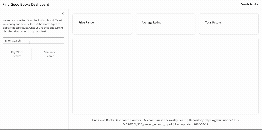
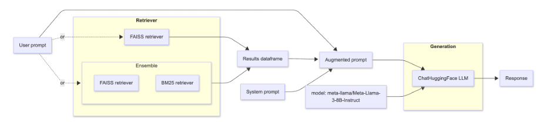

# Find Good Books Dashboard

## Table of Contents

- [About](#about)
- [Setup](#setup)
- [Data](#data)
- [Dashboard](#dashboard)
- [License](#license)
- [Contributors](#contributors)

## About

This dashboard uses a **sample** of books from Amazon's millions of book reviews. The user will be able to search these books using two different types of search systems: key-word- and/or semantic-based.

**Note:** Scripts to create our BM25 and FAISS systems are in one script-`search-systems.py`-rather than individual ones. This is because we created a single object of documents, and subsequently, used it in creating our BM25 retriever and the FAISS vector store in one go.

**Github Repo:** <https://github.com/UBC-MDS/DSCI_575_project_wbeard_mpe1>

## Setup

### 1) Download the repository

Clone the project repository and navigate to the root folder:

``` bash
git clone https://github.com/UBC-MDS/DSCI_575_project_wbeard_mpe1
cd DSCI_575_project_wbeard_mpe1
```

### 2) Create and activate the conda environment

From the repository root:

``` bash
conda env create -f environment.yml
conda activate find-good-books
```

**Note:** throughout running this project, if you run into issues with importing `nltk`, additional downloads/updates may be required.

``` bash
nltk.download('punkt')
nltk.download('stopwords')
```

### 3) Create HuggingFace API key

1. Create HuggingFace account: <https://huggingface.co/login>
2. Click on user icon (top right) and select access tokens.
3. Click create new token button (top right).
4. Token type: "Read"
5. Create token.
6. Save token in `.env`: HUGGINGFACEHUB_API_TOKEN="your_api_key_here", see `.env.sample`

### 4) Download and process data

See data section.

## Data

A sample from Amazon's "Books" reviews. Source: [Reviews and Meta Data](https://amazon-reviews-2023.github.io/)

**Note:** these are very large files. To prevent having every individual download them to run our project, we have pre-sampled data from both the "review" and "meta" datasets. The two results were then joined and turned into a parquet file: `data/processed/merged.parquet`. This was done locally and then pushed to the repository, providing ease of use for anyone running this project. If you would like to see how we did this, please read the instructions below.

The data consists of meta data for each book: author, title, description, genre, overall rating, number of ratings and price. There is also review level data for each book: review text, rating

### 1) Download the raw data

Follow the "Source" link above and download both files for the "Books" category. Unzip the files and place in the `data/raw` folder of this project, locally.

### 2) Generate sample data

To generate a sample of books, their reviews, and merge them into a single parquet file:

``` bash
python src/get_data_sample.py
```

### 3) Regenerate search systems

Since this changes the sample book data, both the key-word and semantic search systems need to be updated to reflect what is now in this parquet file:

``` bash
python src/search-systems.py
```

## Dashboard

Our dashboard is a Shiny for Python app. Currently, our repository is set to private which prevents it from being hosted on Posit Connect Cloud. To run our app and interact with it, please make sure you have followed the [Setup](#setup) instructions and ensure you have the correct environment activated. Once you have done that, proceed.

### 1) Navigate to the project root directory

Run the following command in your terminal. Copy and paste the local URL [**http://127.0.0.1:8000**](http://127.0.0.1:8000){.uri} into your browser to connect.

``` bash
shiny run --reload app/app.py
```

### 2. With our app open

#### Directly search

Enter your search query into the input field and select the search type you would like to use. The generated results are those top-ranked-books based on our data sample.

#### Search with chat

To explore books using chat select the chat tab on the left. Behind the scenes the chat will search the books using either semantic search or an ensemble of semantic and keyword search. Select the search type you at the top then ask the chat about what interests you.

The chat will give a brief summary of the most relevant books and the underlying relevant books will also be displayed on the right.

### Demo



### Retrieval workflows

There are two option for how to explore the book dataset each with two sub-options:

- [Directly searching the database](#direct-search)
  - [Keyword search](#keyword-search-bm25)
  - [Semantic search](#semantic-search-faiss)
- [Search with chat: retriever augmented generation](#retriever-augmented-generation)
  - [Semantic retriever](#semantic-retriever)
  - [Ensemble retriever](#ensemble-retriever)

#### Direct search

For both workflows, first a list of `langchain` `Documents` is created which contain the book meta data and the text to be searched (author, title, description, etc)

##### Keyword search (BM25)

A preprocessor is created for the text to be used in keyword search. This preprocessor has the following steps: lowercase the text, remove all non-alphanumeric characters, and remove common english stopwords.

The `Documents` data and preprocessor are then passed into a `langchain` `BM25Retriever` object and the retriever is saved. The shiny app then load the retriever and passes in the user query.

##### Semantic search (FAISS)

A embedding object is created using functionality from `HuggingFace` with the model `sentence-transformers/all-MiniLM-L6-v2`. 

The `Documents` data and embedding are passing into a `langchain` `FAISS` model and the resulting vector store is saved. The shiny app then loads the vector store and imports the embedding to be able to process the user query.

#### Retriever augmented generation

##### Pipeline



- The user prompt is fed into:
  - one of the two retriever objects
  - the augmented prompt
- A retriever is used to search the book database and returns five relevant books: results dataframe
- The user prompt, results dataframe, and system prompt are combined to created the augmented prompt
- The augmented prompt and model type are passed into a hugging face chat object
- The hugging face chat returns a response

##### Semantic retriever

Use the FAISS retriever pathway in the RAG pipeline

##### Ensemble retriever

Use the Ensemble retriever pathway in the RAG pipeline

## License

MIT license, see `LICENSE`

## Contributors

- Michael Eirikson
- Wesley Beard
